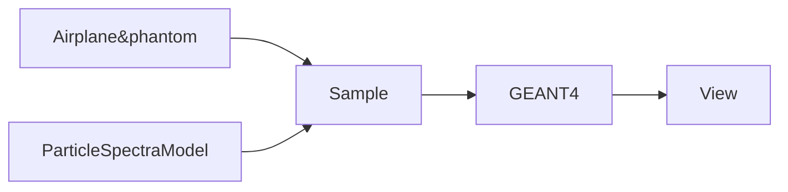

# README

[](https://doi.org/10.5281/zenodo.15106579)

Este repositorio contiene la información necesaria para desplegar un Ejemplo Funcional Repoducible para simular la dosis absorbida por tripulación en un modelo de aeronave simplificada.

El repositorio tiene una estructura de 5 modulos, cada uno permite configurar una parte de la secuencia. Cada modulo se refleja en la estructura de archivos.



## Contenido

### Modelo de aeronave (Airplane&phantom)
Este bloque contiene las definiciones minimas para completar un modelo de aeronave esférico o cilíndrico y un phantom en su interior.

En las instrucciones se explica el contenido de los archivos, como cambiar los parametros y la consecuencia de reparametrizar esta parte del ejemplo en los bloques siguientes.

### Espectro (ParticleSpectraModel)
El espectro esperado esta normalizado para un detector volumetrico de $1~ \rm m^2$ durante un tiempo de $1~ \rm h$.

El archivo tiene filas para cada energía en el rango de 100 keV a 1 TeV con 20 divisiones por década. Cada fila tiene columnas para los valores esperados de cada tipo de partícula. Las partículas estan identificadas según la nomenclatura GPS de GEANT4. Las más comunes son 
* gamma
* e+
* e-
* mu+
* mu-
* pi0
* pi+
* pi-
* neutron
* proton
* anti_proton

### Procesamiento
Los siguientes módulos se encuentran en la carpeta Ejemplo/
Los constituyentes clave son:
* ```gRAMAkit.py```: Contiene la definiciones de clases y funciones que se utilizan.
* ```gRAMA.ipynb```: es un notebook con el script de análisis completo y comentado.
    * La primera parte genera una versión del espacio que se definirá en GEANT4 para optimizar las condiciones de la simulación.
    * La parte final procesa los datos para generar visualizaciones de cortes y calcular la dosis media depositada.
* ```particleIDs.csv```: es una tabla con las equivalencias de nombre de partículas entre CORSIKA, G4 GPS y PDG.
* ```estimacion.sh```: Es un script que ejecuta las simulaciones en GEANT4 y compila los resultados.
    * La simulación se hace mediante el script estimacion.sh contenido en Ejemplo/
    * Este script organiza grupos de partículas según su energía y recopila los resultados de energía depositada en el phantom.
 
### Uso del repositorio
* Clonar el repositorio en una maquina con una instalación de GEANT4 y Python.
    * En el siguiente enlace se puede descargar una VM con una instalación funcional de GEANT4 y Python: [http://fisica.ciens.ucv.ve/jlopez/download/geantGauss01.ova](http://fisica.ciens.ucv.ve/jlopez/download/geantGauss01.ova)
    * Los siguientes paquetes son necesarios:
        * pandas
        * matplotlib.pyplot
        * numpy as np
        * math
        * random
        * mpl_toolkits.mplot3d
        * os
        * json
        * codecs
        * datetime
        * sklearn.cluster
        * scipy.stats
        * statistics
        * time
* Copiar el contenido de una de las carpetas de Airplane&phantom en Ejemplo/aeronaveG4/
* Ejecutar el notebook gRAMA.ipynb siguiendo las instrucciones.